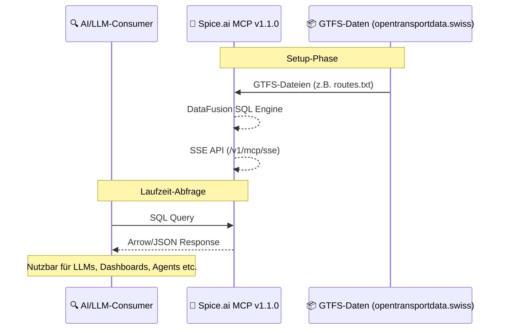
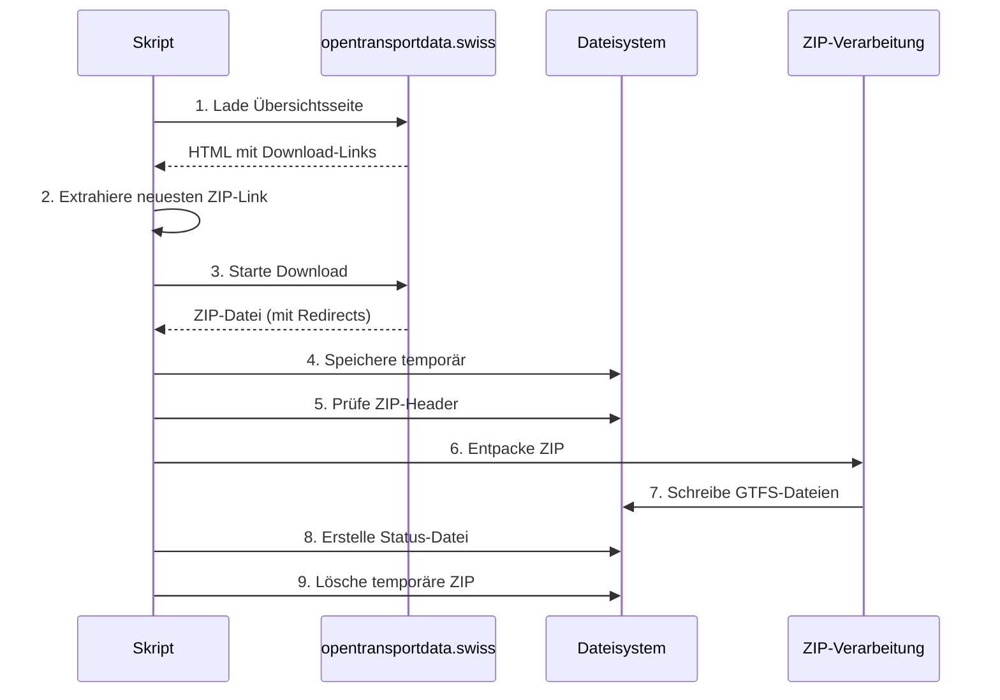

# ZVV-GTS-MCP Server

## Übersicht

**ZVV-GTS-MCP** ist ein serverseitiges Projekt zur Aufbereitung und Bereitstellung von ÖV-Daten des **Zürcher Verkehrsverbunds (ZVV)** auf Basis der GTFS-Daten von [opentransportdata.swiss](https://data.opentransportdata.swiss/dataset/timetable-2025-gtfs2020).

Das Ziel ist es, diese Daten strukturiert über die **Spice.ai MCP Engine** zugänglich zu machen – als Schnittstelle für nachgelagerte AI-Projekte, Datenanalysen oder LLM-Abfragen.

> ✳️ **Hinweis:** Dieses Projekt stellt kein Chat-Interface oder Frontend bereit. Es fokussiert sich ausschliesslich auf die Datenverfügbarkeit über MCP.

## Architektur

### Systemkomponenten


### Technologie-Stack
- **Spice.ai v1.1.0**: MCP-Server mit SSE-API
- **DataFusion**: Schnelle SQL-Abfragen
- **Apache Arrow**: Effiziente Datenformate
- **Node.js**: GTFS-Datenverarbeitung

### Datenfluss
1. **Datenquelle:** GTFS-Daten von opentransportdata.swiss
2. **Verarbeitung:** SQL-Transformation via DataFusion
3. **Bereitstellung:** SSE-API über Spice.ai MCP
4. **Nutzung:** Direkter SQL-Zugriff für AI/LLM-Systeme

## Features

- 🚈 Integration der offiziellen **GTFS-Daten 2025** des ZVV
- ⚙️ **Spice.ai MCP** als Daten-Backend für strukturierte AI-Zugriffe
- 🔌 Bereitstellung von MCP-kompatiblen Datasets (`routes`, `stops`, etc.)
- ☁️ Deployment-fähig auf **Vercel** (z. B. als Headless Daten-Service)

## Technische Details

### Projektstruktur
```
mcp-gtfs/
├── download-gtfs.js     # Skript zum automatischen Download der GTFS-Daten
├── package.json         # Node.js-Projektkonfiguration
├── zvv-data/           # Verzeichnis für GTFS-Daten
│   └── gtfs/           # GTFS-Rohdaten (wird automatisch gefüllt)
│       └── gtfs-status.json  # Metadaten zum letzten Download
└── README.md           # Diese Dokumentation
```

### Datenbeschaffung

#### Automatischer Download-Prozess


#### GTFS-Datenstruktur
Die GTFS-Rohdaten werden im Verzeichnis `zvv-data/gtfs/` abgelegt und nicht versioniert. Stattdessen werden sie automatisch von [opentransportdata.swiss](https://data.opentransportdata.swiss/dataset/timetable-2025-gtfs2020) bezogen.

**Kern-Datensätze:**
- `agency.txt` – Verkehrsunternehmen
- `stops.txt` – Haltestellen
- `routes.txt` – Linien
- `trips.txt` – Fahrten
- `stop_times.txt` – Haltestellenzeiten
- `calendar.txt` – Betriebstage
- `calendar_dates.txt` – Ausnahmen
- `feed_info.txt` – Metadaten
- `transfers.txt` – Umsteigebeziehungen

> **Hinweis:** `shapes.txt` (Linienführungen) ist in der Schweizer GTFS-Implementierung nicht enthalten.

## Deployment

### Voraussetzungen
1. **Spice.ai CLI** (v1.1.0 oder höher)
   ```bash
   # Installation siehe:
   https://docs.spiceai.org/getting-started/installation
   ```

2. **Node.js Dependencies**
   ```bash
   npm install
   ```

### Datenverwaltung

#### Automatische GTFS-Datenaktualisierung
Das System prüft bei jedem Start, ob alle erforderlichen GTFS-Dateien vorhanden sind:

**Erforderliche Dateien:**
- `agency.txt` – Verkehrsunternehmen
- `stops.txt` – Haltestellen
- `routes.txt` – Linien
- `trips.txt` – Fahrten
- `stop_times.txt` – Haltestellenzeiten
- `calendar.txt` – Betriebstage
- `calendar_dates.txt` – Ausnahmen
- `feed_info.txt` – Metadaten
- `transfers.txt` – Umsteigebeziehungen

**Intelligenter Download:**
- ✅ Prüft zuerst, ob alle Dateien vorhanden sind
- ✅ Lädt nur bei fehlenden Dateien neu
- ✅ Spart Bandbreite und Zeit
- ✅ Verhindert unnötige Downloads

#### Server starten
```bash
npm start
```

Der Server ist dann über `http://localhost:3000/v1/mcp/sse` erreichbar.

### Status-Tracking
Nach jedem erfolgreichen Download wird eine `gtfs-status.json` erzeugt mit:
- Dateiname
- Download-URL
- Zeitstempel
- Quelle

## Lizenz & Quellen

- GTFS-Daten: [opentransportdata.swiss – Fahrplan 2025 (GTFS2020)](https://data.opentransportdata.swiss/de/dataset/timetable-2025-gtfs2020)
- Spice.ai MCP: [Dokumentation](https://docs.spiceai.org/)
