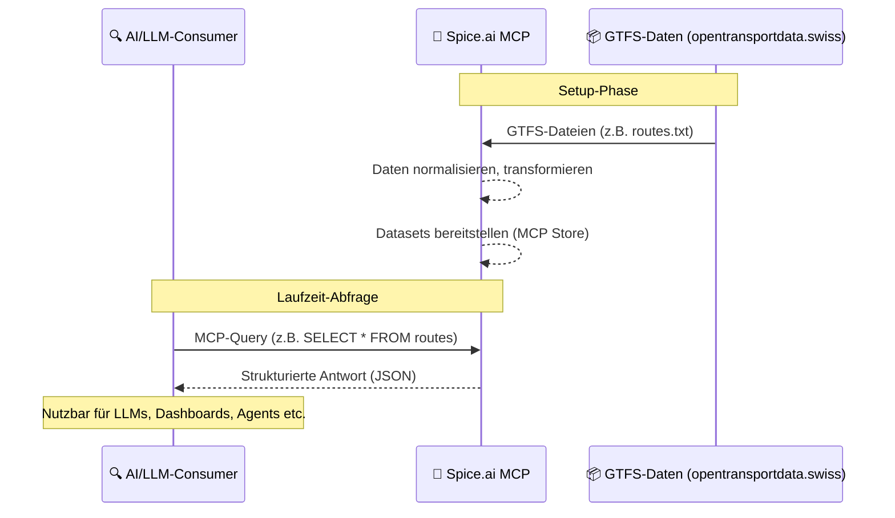
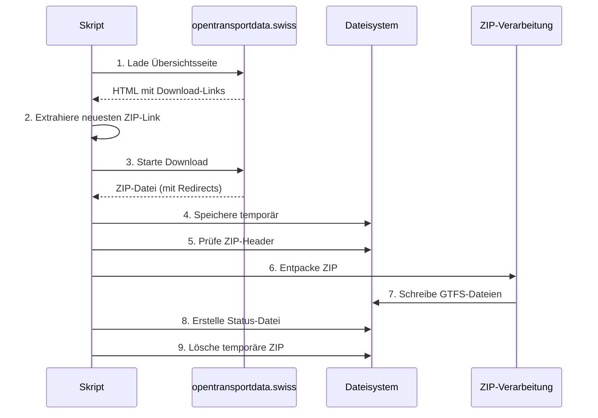

# ZVV-GTS-MCP Server

## Übersicht

**ZVV-GTS-MCP** ist ein serverseitiges Projekt zur Aufbereitung und Bereitstellung von ÖV-Daten des **Zürcher Verkehrsverbunds (ZVV)** auf Basis der GTFS-Daten von [opentransportdata.swiss](https://data.opentransportdata.swiss/dataset/timetable-2025-gtfs2020).

Das Ziel ist es, diese Daten strukturiert über die **Spice.ai MCP Engine** zugänglich zu machen – als Schnittstelle für nachgelagerte AI-Projekte, Datenanalysen oder LLM-Abfragen.

> ✳️ **Hinweis:** Dieses Projekt stellt kein Chat-Interface oder Frontend bereit. Es fokussiert sich ausschliesslich auf die Datenverfügbarkeit über MCP.

## Architektur

### Systemkomponenten


### Datenfluss
1. **Datenquelle:** GTFS-Daten von opentransportdata.swiss
2. **Verarbeitung:** Automatische Transformation in MCP-Datasets
3. **Bereitstellung:** Strukturierte API über Spice.ai MCP
4. **Nutzung:** Zugriff durch AI/LLM-Systeme

## Features

- 🚈 Integration der offiziellen **GTFS-Daten 2025** des ZVV
- ⚙️ **Spice.ai MCP** als Daten-Backend für strukturierte AI-Zugriffe
- 🔌 Bereitstellung von MCP-kompatiblen Datasets (`routes`, `stops`, etc.)
- ☁️ Deployment-fähig auf **Vercel** (z. B. als Headless Daten-Service)

## Technische Details

### Projektstruktur
```
mcp-gtfs/
├── download-gtfs.js     # Skript zum automatischen Download der GTFS-Daten
├── package.json         # Node.js-Projektkonfiguration
├── zvv-data/           # Verzeichnis für GTFS-Daten
│   └── gtfs/           # GTFS-Rohdaten (wird automatisch gefüllt)
│       └── gtfs-status.json  # Metadaten zum letzten Download
└── README.md           # Diese Dokumentation
```

### Datenbeschaffung

#### Automatischer Download-Prozess


#### GTFS-Datenstruktur
Die GTFS-Rohdaten werden im Verzeichnis `zvv-data/gtfs/` abgelegt und nicht versioniert. Stattdessen werden sie automatisch von [opentransportdata.swiss](https://data.opentransportdata.swiss/dataset/timetable-2025-gtfs2020) bezogen.

**Kern-Datensätze:**
- `agency.txt` – Verkehrsunternehmen
- `stops.txt` – Haltestellen
- `routes.txt` – Linien
- `trips.txt` – Fahrten
- `stop_times.txt` – Haltestellenzeiten
- `calendar.txt` – Betriebstage
- `calendar_dates.txt` – Ausnahmen
- `feed_info.txt` – Metadaten
- `transfers.txt` – Umsteigebeziehungen

> **Hinweis:** `shapes.txt` (Linienführungen) ist in der Schweizer GTFS-Implementierung nicht enthalten.

## Deployment

### Automatische Aktualisierung
Die GTFS-Daten werden automatisch aktualisiert:
- Beim Deployment (z.B. auf Vercel)
- Nach jedem `npm install`
- Manuell via `node download-gtfs.js`

### Abhängigkeiten
```bash
npm install cheerio unzipper
```

### Status-Tracking
Nach jedem erfolgreichen Download wird eine `gtfs-status.json` erzeugt mit:
- Dateiname
- Download-URL
- Zeitstempel
- Quelle

## Lizenz & Quellen

- GTFS-Daten: [opentransportdata.swiss – Fahrplan 2025 (GTFS2020)](https://data.opentransportdata.swiss/de/dataset/timetable-2025-gtfs2020)
- Spice.ai MCP: [Dokumentation](https://docs.spiceai.org/)
