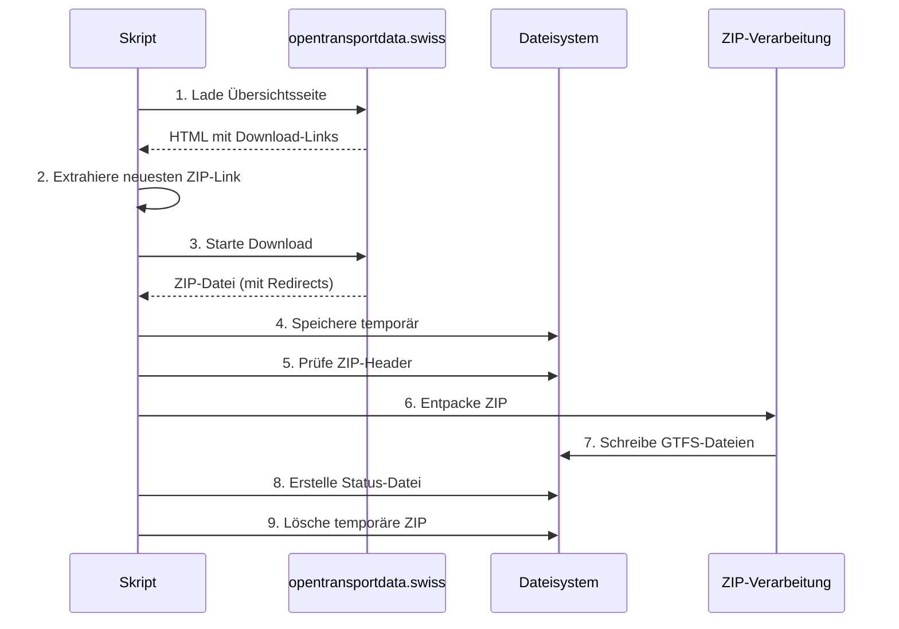
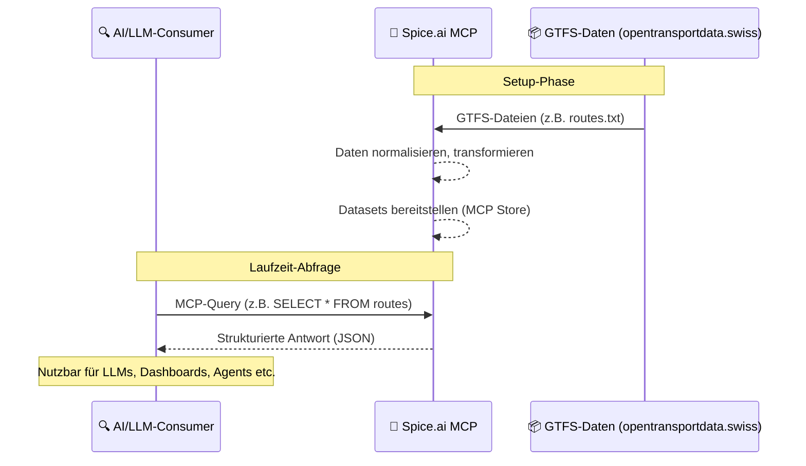

# ZVV-GTS-MCP Server

## Zweck

**ZVV-GTS-MCP** ist ein serverseitiges Projekt zur Aufbereitung und Bereitstellung von ÖV-Daten des **Zürcher Verkehrsverbunds (ZVV)** auf Basis der GTFS-Daten von [opentransportdata.swiss](https://data.opentransportdata.swiss/dataset/timetable-2025-gtfs2020).

Das Ziel ist es, diese Daten strukturiert über die **Spice.ai MCP Engine** zugänglich zu machen – als Schnittstelle für nachgelagerte AI-Projekte, Datenanalysen oder LLM-Abfragen.

> ✳️ **Hinweis:** Dieses Projekt stellt kein Chat-Interface oder Frontend bereit. Es fokussiert sich ausschliesslich auf die Datenverfügbarkeit über MCP.

---

## Features

- 🚈 Integration der offiziellen **GTFS-Daten 2025** des ZVV
- ⚙️ **Spice.ai MCP** als Daten-Backend für strukturierte AI-Zugriffe
- 🔌 Bereitstellung von MCP-kompatiblen Datasets (`routes`, `stops`, etc.)
- ☁️ Deployment-fähig auf **Vercel** (z. B. als Headless Daten-Service)

---

## Projektstruktur

```bash
zvv-gts-mcp/
├── zvv-data/          # Spice.ai Datenprojekt
│   ├── gtfs/          # GTFS-Dateien (routes.txt, stops.txt, ...)
│   └── spicepod.yaml  # Dataset-Definitionen
├── README.md
└── ...
```

### Projektstruktur
```
mcp-gtfs/
├── download-gtfs.js     # Skript zum automatischen Download der GTFS-Daten
├── package.json         # Node.js-Projektkonfiguration
├── zvv-data/           # Verzeichnis für GTFS-Daten
│   └── gtfs/           # GTFS-Rohdaten (wird automatisch gefüllt)
│       └── gtfs-status.json  # Metadaten zum letzten Download
└── README.md           # Diese Dokumentation
```

### Sequenzdiagramm: GTFS-Download-Prozess


---

## GTFS-Datenstruktur

Im Verzeichnis `zvv-data/gtfs/` werden die offiziellen GTFS-Rohdaten des Zürcher Verkehrsverbunds (ZVV) abgelegt. Diese Dateien werden nicht versioniert (siehe `.gitignore`), sondern jeweils aktuell von [opentransportdata.swiss](https://data.opentransportdata.swiss/dataset/timetable-2025-gtfs2020) bezogen.

**Wichtige Dateien:**

- `agency.txt` – Informationen zu den Verkehrsunternehmen
- `stops.txt` – Haltestellen
- `routes.txt` – Linien
- `trips.txt` – Fahrten
- `stop_times.txt` – Haltestellenzeiten
- `calendar.txt` – Betriebstage
- `calendar_dates.txt` – Ausnahmen im Betriebskalender
- `feed_info.txt` – Metadaten zum Feed
- `transfers.txt` – Umsteigebeziehungen (optional)

> **Hinweis:** Die Datei `shapes.txt` (Linienführungen) ist in der Schweizer GTFS-Implementierung aktuell nicht enthalten.

---

## Datenfluss



---

## Automatische GTFS-Datenaktualisierung

Die jeweils aktuellsten GTFS-Rohdaten werden beim Deployment oder nach jedem `npm install` automatisch heruntergeladen und entpackt.

### Motivation und Ziel

Das Ziel ist, dass die Anwendung immer mit den aktuellsten Fahrplandaten des Zürcher Verkehrsverbunds (ZVV) arbeitet, ohne dass große Rohdaten im Repository gespeichert werden müssen. So bleibt das Projekt leichtgewichtig, aktuell und einfach zu deployen – sowohl lokal als auch auf Cloud-Plattformen wie Vercel.

### Geplanter Ablauf

1. **Automatischer Download:**
   - Beim Deployment (z. B. auf Vercel) oder nach jedem lokalen `npm install` wird das Skript [`download-gtfs.js`](./download-gtfs.js) automatisch ausgeführt.
   - Das Skript ruft die Seite mit den GTFS-Downloads ([opentransportdata.swiss](https://data.opentransportdata.swiss/de/dataset/timetable-2025-gtfs2020)) auf und sucht dort nach dem Link zur neuesten ZIP-Datei.
2. **Herunterladen und Entpacken:**
   - Die ZIP-Datei wird heruntergeladen und direkt nach `zvv-data/gtfs/` entpackt.
   - Alle enthaltenen GTFS-Textdateien stehen danach im Projektverzeichnis zur Verfügung.
3. **Nutzung durch die Anwendung:**
   - Die Anwendung kann sofort auf die aktuellen Daten zugreifen, z. B. für AI/LLM-Analysen, Datenabfragen oder als MCP-Datenquelle.

### Vorteile dieses Ansatzes
- **Immer aktuell:** Es werden stets die neuesten offiziellen Daten verwendet.
- **Kein Datenballast im Repo:** Große Dateien werden nicht versioniert, das Repository bleibt schlank.
- **Automatisierbar:** Funktioniert lokal und in Cloud-Deployments ohne manuelle Eingriffe.
- **Nachvollziehbar:** Die Datenquelle ist transparent und im README dokumentiert.

### Nutzung

**Automatisch:**
- Das Skript wird automatisch im `postinstall`-Schritt der `package.json` ausgeführt:
  ```bash
  npm install
  ```
  oder beim Deployment (z. B. auf Vercel).

**Manuell:**
- Das Skript kann auch manuell ausgeführt werden:
  ```bash
  node download-gtfs.js
  ```

### Abhängigkeiten
- Es werden die Pakete [`cheerio`](https://www.npmjs.com/package/cheerio) und [`unzipper`](https://www.npmjs.com/package/unzipper) benötigt:
  ```bash
  npm install cheerio unzipper
  ```

### Hinweis
- Die GTFS-Daten werden nicht im Repository versioniert, sondern immer aktuell bezogen.
- Quelle: [opentransportdata.swiss – Fahrplan 2025 (GTFS2020)](https://data.opentransportdata.swiss/de/dataset/timetable-2025-gtfs2020)

**Status- und Metadaten:**
- Nach jedem erfolgreichen Download und Entpacken wird automatisch eine Datei [`zvv-data/gtfs/gtfs-status.json`](zvv-data/gtfs/gtfs-status.json) erzeugt.
- Diese enthält Informationen zum verwendeten GTFS-Archiv (Dateiname, Download-URL, Zeitstempel, Quelle etc.).
- So ist jederzeit nachvollziehbar, welche Datenbasis aktuell im Projekt liegt.
